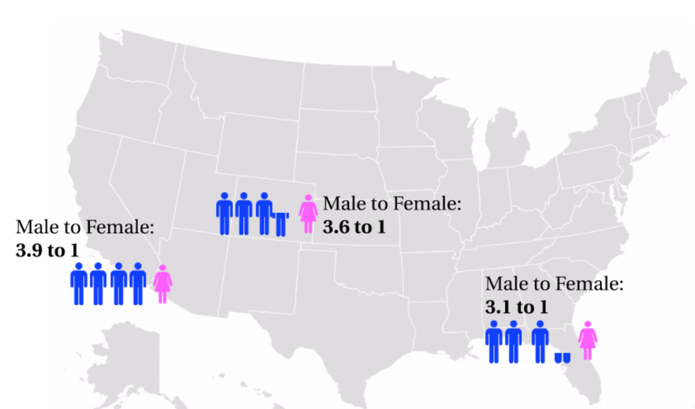
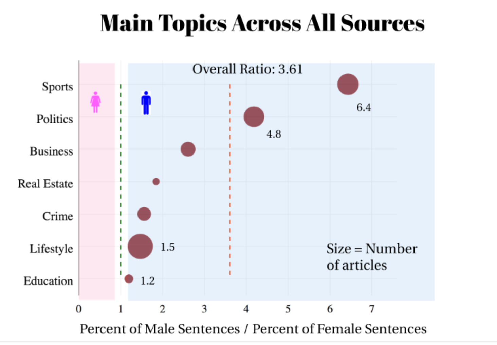
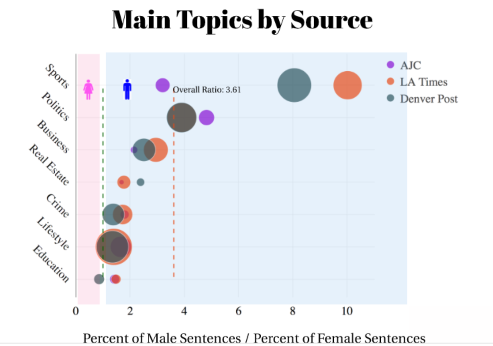
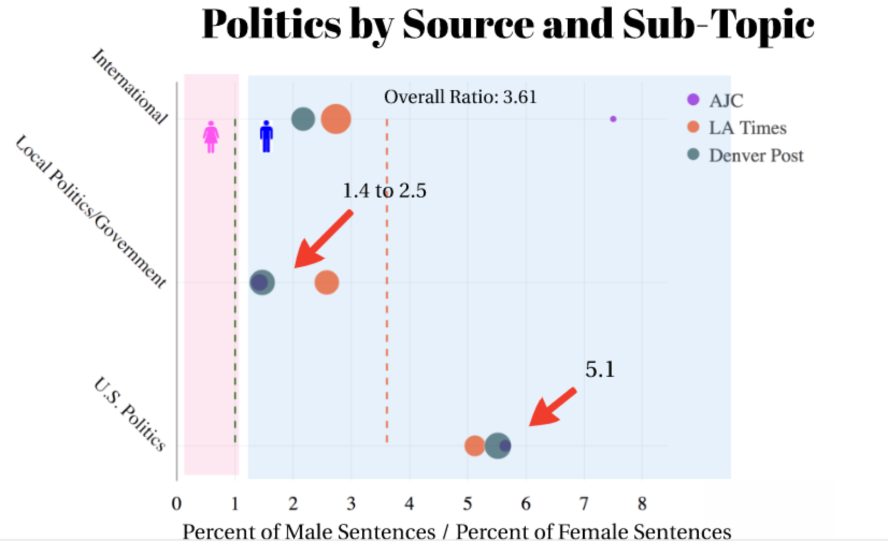

# Gender Representation in the News

## OVERVIEW

Media is both an influence and a reflection of our society.  The purpose of this project is to set up a process by which we can examine the representation of men and women in the news.  How often are each gender mentioned?  Are there certain topics that they are 'male' and others that are 'female'?  Do we see differences across regions?  What does this say about our society?

Analysis was done using article from three sources, Los Angeles Times, the Denver Post, the Atlanta Journal Constitution, covering June 5th to June 15th, 2017.  

Using Negative Matrix Factorization, topics were created across all sources for easier topic comparisons.  NMF yielded 60 topics.

To analyze gender, a process based on Neal Caren's work* was utilized.  Each sentence was categorized into one of four categories, male only, female only, male and female or none.  This was done by utilizing a list of gender-identifying words, such as 'he', 'she', 'him', 'her', etc.

Overall, across the 3 sources and all topics, there were 3.6 male sentences for every one female sentence.  Similar to what Caren found for the NYT, (3.2 male sentences for every 1 female sentence).

LA Times had the most mentions of men compared to women at 3.9 male sentences for every 1 female sentence.  While AJC had the fewest, with 3.1 male sentences for every 1 female sentence.

Topics that had the most mentions of men compared to women, were Sports and Politics.  While Education and Lifestyle were most gender balanced.  However, no topic mentioned females more often than males.

Breaking down the sources by topics gives us the best indication of why the LA Times had the highest male to female sentence ratio and AJC the lowest.  Articles covering Sports had 10 male sentences for every 1 female sentence.  While AJC had fewer than 4 male sentences for every 1 female sentence.  

Finally, just narrowing in on one of the main topics, politics, we can gain some insight into what is driving these numbers.  U.S. Politics is references men 5.1 times more often than women, consistent across all sources.  However, Local Politics is much more gender equal, in particular for AJC and The Denver Post.

## THE PROCESS

### Web-Scraping Methodology
All sources were scraped using RSS feeds and directly input into MongoDB.

Denver Post and LA Times:  Using the python package Scrapy, a scraping system was built that pulled articles from RSS feed.  The system utilizes multi-threading and 'politeness' to increase performance without overloading server.  Scrapy projects for [The Denver Post](src/denpost) and [LA Times](src/latimes) are located in their respective folders within src.

AJC: RSS feed was not available so the python package 'newspaper' was utilized.  Code to pull the AJC articles is here: [ajc-scraping-code](src/pull_all_articles.py)

### Data Cleaning

All of the data sources needed to have the following done before it the articles could be used in analysis.
1. Unicode removed
2. Non-ascii code removed
3. Changed contractions to their long form

Additionally each source had unique challenges that needed to be addressed.  For example, The Denver Post would sometimes include the author of their article in the article itself, 'by John Smith,'.  These types of special circumstances were removed on a source by source bases using regular experssions.

One python script can be used to clean all sources simply by referencing the source when running the [script](src/clean_data.py).  Example: python clean_data.py ajc

### Topic modeling

There are many steps to finding meaningful latent topics.  For all sources the following steps were performed.

#### Removing Stop words

When creating latent topics, it is useful to remove words which make sentences grammatically correct, but do not enhance the meaning of a sentences.  Python's NLTK provides a common list of stop words which were removed prior to topic modeling.  These words include words such as [a, an, and, are, as, be, by, for from...].  

#### Stemming and lemmatizing

Words such as 'run' and 'running' generally provide the same meaning in a sentence and ideally will be treated as the same word when creating the term frequency matrix needed for topic modeling.  Therefore it is common to stem or lemmatize the words in a corpus prior to topic modeling.  For this project 4 different stemmers and lemmatizers,  Porter Stemmer,
WordNet Lemmatizer, Lancaster Stemmer and the Snowball Stemmer, were tested to determine which performed best on the articles for latent topic modeling.  The WordNet Lemmatizer was chosen for the final topic model as it provided the as good of topics as the Lancaster Stemmer while allowing an easier interpretation of the terms in each topic found.

#### TF-IDF matrix

Machines need numbers to

References

*https://www.theverge.com/2013/5/10/4319386/gender-in-the-new-york-times-mapped-with-python-scripts
*https://www1.udel.edu/comm245/readings/GenderedMedia.pdf
*https://civic.mit.edu/blog/natematias/best-practices-for-ethical-gender-research-at-very-large-scales

CODE EXAMPLES

https://github.com/malev/gender-detector
http://nbviewer.jupyter.org/gist/nealcaren/5105037
https://github.com/bbengfort/gender-words-fatale
